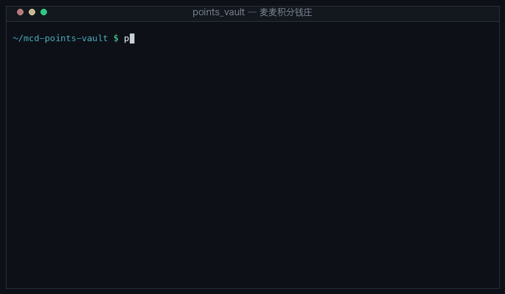

# 麦麦积分钱庄 · McPoints Vault

**把麦当劳会员账户里的积分和优惠券，当成一份资产来管。**

你的积分值多少钱？哪一项兑换最划算？有多少积分正在逼近过期线？

这个 Skill 会给你的麦当劳账户做一次**资产体检**，输出一份可以直接截图的报告。

> 一句话价值：**量化你的积分现值，找出最优兑换出口，拦住即将蒸发的资产。**

---

<!-- 演示动图占位：录一段 15 秒的使用过程，导出为 demo.gif 放在仓库根目录，然后把下面这行取消注释。

-->

## 它能算出什么

用内置演示数据运行，真实输出如下（完整报告见 [`examples/`](examples)）：

```
你的麦麦账户现值 ¥201.54，其中 950 积分（约 ¥51.30）
将在 30 天内过期 —— 不管它就真的没了。
```

| 项目 | 数值 | 说明 |
| --- | ---: | --- |
| 可用积分 | 3,260 | 可随时兑换 |
| 积分最优汇率 | 5.40 元/100分 | 现行最划算的兑换出口 |
| 积分账面价值 | ¥176.04 | 按最优汇率折算 |
| 券面总值 | ¥25.50 | 3 张券 |
| **资产合计** | **¥201.54** | 积分 + 券 |
| ⚠️ 风险敞口 | ¥51.30 | 30 天内过期部分 |

**积分变现效率排行**（每 100 积分能换回多少人民币）：

| 排名 | 兑换项 | 所需积分 | 每 100 积分兑 | 建议 |
| ---: | --- | ---: | ---: | --- |
| 1 | 麦乐鸡 5 块兑换券 | 250 | 5.40 元 | **优先兑换** |
| 2 | 巨无霸汉堡兑换券 | 500 | 5.30 元 | **优先兑换** |
| 3 | 中杯可乐兑换券 | 180 | 5.00 元 | 值得考虑 |
| 8 | 麦当劳经典马克杯（周边） | 3,800 | 1.55 元 | 暂缓 |

> 周边商品的积分效率往往不足餐品券的 **1/3**。这份排行会直接告诉你。

**并给出可执行的兑换路径** —— 用 930 积分换回 ¥49.50，覆盖 30 天内的过期敞口。

---

## 30 秒上手（不需要 Token）

```bash
git clone https://github.com/<你的用户名>/mcd-points-vault.git
cd mcd-points-vault
python3 scripts/points_vault.py --demo
```

零依赖，纯 Python 标准库，不联网。立刻就能看到上面那份报告。

## 接入真实账户（2 分钟）

**第 1 步 · 申请麦当劳 MCP Token**

前往 https://open.mcd.cn/mcp ，手机号登录 → 右上角「控制台」→ 点击「激活」→ 一键复制 Token。

**第 2 步 · 在 WorkBuddy 中配置连接器**

左侧边栏【专家·技能·连接器】→【连接器】→ 右上角【自定义连接器】→【配置 MCP】，填入：

```json
{
  "mcpServers": {
    "mcd-mcp": {
      "type": "streamablehttp",
      "url": "https://mcp.mcd.cn",
      "headers": {
        "Authorization": "Bearer 你的_TOKEN"
      }
    }
  }
}
```

保存后回到【自定义连接器】，把 `mcd-mcp` **启用**。

**第 3 步 · 开始体检**

在对话框里直接说：

```
帮我看看我的麦当劳积分，怎么花最划算
```

Skill 会自动调用 MCP 拉取你的真实账户数据，然后输出体检报告。

## 工作原理

```
now-time-info ────────┐
query-my-account ─────┤   MCP 实时拉取
mall-points-products ─┼──► 归一化 ──► 本地估值引擎 ──► 资产体检报告
query-my-coupons ─────┤              (纯标准库，可离线复现)
campaign-calendar ────┘
```

三个核心计算：

| 指标 | 公式 |
| --- | --- |
| 每 100 积分兑现价值 | `商品参考价值 ÷ 所需积分 × 100` |
| 积分账面价值 | `可用积分 × 最优汇率` |
| 风险敞口 | `30 天内到期的积分 × 最优汇率` |

详细模型见 [`references/valuation-model.md`](references/valuation-model.md)。

## 目标用户

- **麦门常客**：积分攒了不少，但从没认真算过值多少钱
- **积分即将过期的人**：需要知道「还剩几天、还能换什么」
- **性价比敏感的用户**：想知道商城里的兑换项哪个最划算
- **做家庭消费决策的人**：把账户权益当成一笔真实的家庭资产来管理

## 项目结构

```
mcd-points-vault/
├── SKILL.md                      # 技能定义与执行流程
├── scripts/
│   └── points_vault.py           # 估值引擎（纯标准库，零依赖）
├── references/
│   ├── tool-playbook.md          # MCP 工具调用手册
│   └── valuation-model.md        # 估值模型与标准输入格式
├── examples/
│   └── demo-account.json         # 演示数据
├── README.md                     # 本文件
├── MCP_INTEGRATION.md            # MCP 集成说明
├── CONTEST_DECLARATION.md        # 参赛声明（官方原文）
└── mcp-config.example.json       # 脱敏配置示例
```

## 使用自己的数据

估值引擎与网络完全解耦，可以喂任意数据：

```bash
# 从文件读取
python3 scripts/points_vault.py --input my-account.json

# 从 stdin 读取
cat my-account.json | python3 scripts/points_vault.py --input -

# 输出 JSON 便于二次开发
python3 scripts/points_vault.py --input my-account.json --json

# 复现历史日期的报告
python3 scripts/points_vault.py --input my-account.json --today 2026-10-09
```

输入格式见 [`references/valuation-model.md`](references/valuation-model.md)，字段命名有容错，可直接喂入 MCP 原始返回值。

## 设计原则

- **只做决策，不碰抽奖**：刻意不接入积分抽奖工具，避免宣扬赌博的合规风险
- **写操作必须人工确认**：真实扣减积分的操作绝不自动执行
- **不编造数据**：拿不到价格就标注缺失，不猜
- **引擎离线可跑**：任何人都能在没有 Token 的情况下验证它的逻辑

---

## 如果这个项目帮到了你

欢迎点一个 **Star** ⭐ —— 对独立开发者是很大的鼓励，也能让更多麦门朋友少浪费一笔积分。

有问题或想法，欢迎提 Issue。

## 免责声明

- 本项目为「麦当劳程序员创意开发大赛」参赛作品，由参赛者独立开发，**非麦当劳官方产品**。
- 项目输出仅供参考，不构成医疗、营养、投资或其他专业建议。
- 餐品信息、价格、积分价值及供应状态以麦当劳官方渠道的实时结果为准。

## License

[MIT](LICENSE)
